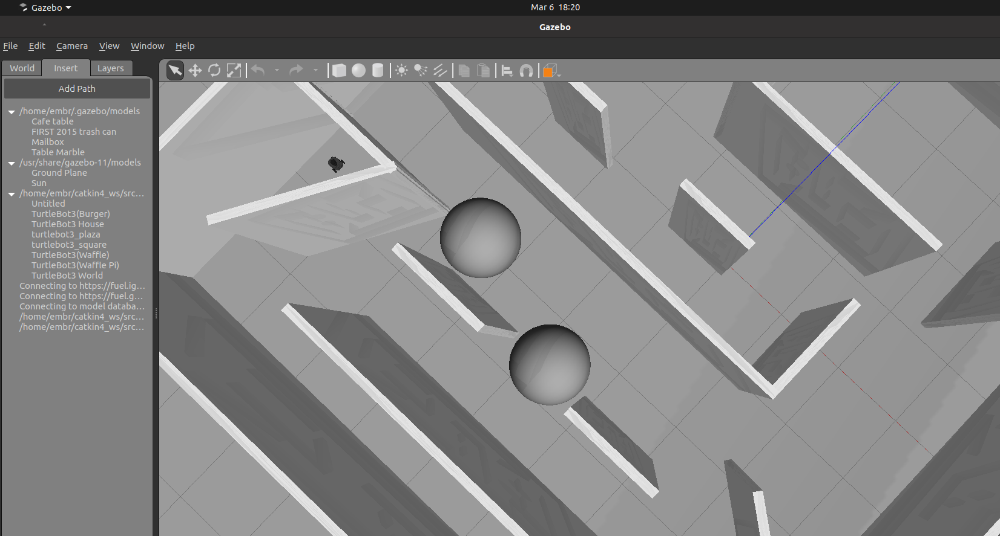
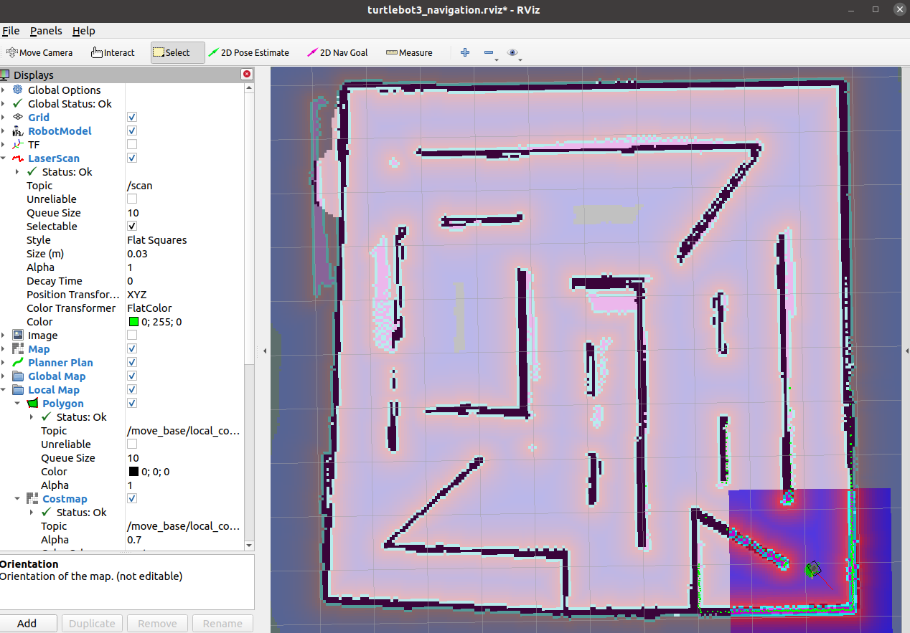

# TurtleBot3 Maze Navigation with Autonomous Waypoints

A ROS-based autonomous navigation system for TurtleBot3 robots in simulated maze environments using Gazebo. The robot can create maps of unknown spaces and navigate through them autonomously using waypoint automation.

## Features

- **Autonomous Mapping** — Robot creates maps of unknown environments using SLAM (Simultaneous Localization and Mapping)
- **Map-Based Navigation** — Navigates using pre-built or newly created maps
- **Waypoint Automation** — Automatically visits predefined waypoints in sequence
- **Gazebo Simulation** — Full physics-based simulation environment
- **Real-Time Visualization** — RViz integration for live monitoring
- **Custom Maze Worlds** — Configurable environments for testing

## Screenshots

### Gazebo Simulation - The Maze World
This is the 3D virtual environment where the robot explores and learns the maze layout. The white walls and gray obstacles are detected by the robot's laser scanner. The different line colours represent different axis with red, green and blue indicating x-axis, y-axis and z-axis respectively.



### RViz Visualization - Navigation & Mapping
This shows what the robot "sees" and understands. The dark black areas are walls (obstacles), the pink area is free space where the robot can move, and the colored dots show the robot's sensor data. The red squirmy line with green circle is the robot's position and planned navigation path.

**Note:** If the robot's position appears misaligned with the map, use the 2D Pose Estimate tool to manually correct its location.



## Screenshots

### Gazebo Simulation Environment
The 3D physics-based world where the robot explores and learns the maze layout. You can see the walls, obstacles, and paths the robot can take.


### RViz Navigation Visualization
Real-time map view showing what the robot sees and knows about its environment. The black areas are walls, pink areas are free space, and the colorful gradient shows obstacle distance and cost information.


## Quick Start

### Prerequisites

- ROS Noetic (Ubuntu 20.04)
- Gazebo 11+
- TurtleBot3 packages
- Python 3.8+

### Installation

```bash
# Clone the repository
cd ~/catkin4_ws/src
git clone https://github.com/jabchup/turtlebot3-maze-navigation.git
cd ~/catkin4_ws

# Build the workspace
catkin_make

# Source the setup file
source devel/setup.bash
```

### Running the Simulation

#### 1. Create a New Map (SLAM Mode)

Open 5 terminals:

**Terminal 1:** Start Gazebo simulation
```bash
export TURTLEBOT3_MODEL=burger
roslaunch turtlebot3_gazebo turtlebot3_world.launch
```

**Terminal 2:** Bring up the robot
```bash
export TURTLEBOT3_MODEL=burger
roslaunch turtlebot3_bringup turtlebot3_remote.launch
```

**Terminal 3:** Start mapping
```bash
export TURTLEBOT3_MODEL=burger
roslaunch turtlebot3_slam turtlebot3_gmapping.launch
```

**Terminal 4:** Open visualization
```bash
export TURTLEBOT3_MODEL=burger
rviz -d $(rospack find turtlebot3_slam)/rviz/turtlebot3_gmapping.rviz
```

**Terminal 5:** Control the robot (use arrow keys)
```bash
export TURTLEBOT3_MODEL=burger
roslaunch turtlebot3_teleop turtlebot3_teleop_key.launch
```

After exploring the maze, save the map:
```bash
rosrun map_server map_saver -f ~/my_maze_map
```

#### 2. Navigate Using Saved Map (Autonomous Mode)

```bash
export TURTLEBOT3_MODEL=burger
roslaunch turtlebot3_navigation pb32_launch_everything.launch
```

This launches:
- Gazebo simulation with maze world
- Navigation stack with localization
- Waypoint automation
- RViz visualization

## Project Structure

```
catkin4_ws/
├── src/
│   ├── my_simulations/          # Custom simulation worlds and configs
│   │   ├── launch/              # Launch files
│   │   ├── maps/                # Saved map files
│   │   ├── worlds/              # Gazebo world files
│   │   └── models/              # 3D models
│   ├── my_warehsebot_package/   # Waypoint automation scripts
│   │   └── scripts/
│   │       └── mini_proj.py     # Autonomous waypoint navigation
│   ├── turtlebot3/              # TurtleBot3 core packages
│   └── turtlebot3_simulations/  # Gazebo simulation packages
├── .gitignore
└── README.md
```

## Key Files

| File | Purpose |
|------|---------|
| `pb32_launch_everything.launch` | Main launch file for autonomous navigation |
| `maze.world` | Gazebo maze environment |
| `jabar_world_miniProject.yaml` | Saved map of the maze |
| `mini_proj.py` | Autonomous waypoint navigation script |

## How It Works

### Mapping Phase
1. Robot explores the maze using SLAM
2. Laser scanner detects walls and obstacles
3. Map is built in real-time in RViz
4. Once exploration is complete, map is saved as `.pgm` and `.yaml` files

### Navigation Phase
1. Saved map is loaded by map_server
2. Robot localizes itself within the map (AMCL)
3. Waypoints are sent to the navigation stack
4. Robot autonomously navigates to each waypoint
5. Real-time visualization shows robot position and planned path

## Customization

### Change the Map
Edit the default map file in launch file:
```bash
gedit ~/catkin4_ws/src/turtlebot3/turtlebot3_navigation/launch/pb32_launch_everything.launch
```

Change line 4:
```xml
<arg name="map_file" default="$(find turtlebot3_navigation)/maps/YOUR_MAP.yaml"/>
```

### Modify Waypoints
Edit the waypoint script:
```bash
gedit ~/catkin4_ws/src/my_warehsebot_package/scripts/mini_proj.py
```

Waypoints are defined as `(x, y, theta)` coordinates.

### Create Custom Worlds
Add new Gazebo world files to `src/my_simulations/worlds/` and reference them in launch files.

## Troubleshooting

**Problem:** "Package not found" error
```bash
# Solution: Make sure to source the workspace
source ~/catkin4_ws/devel/setup.bash
```

**Problem:** Map doesn't appear in RViz
```bash
# Solution: Check the map topic in RViz Displays panel
# Make sure "Map" display is added with topic "/map"
```

**Problem:** Robot doesn't move
```bash
# Solution: Verify map_server is running
# Check: rostopic list | grep map
```

## Performance Notes

- **Map Resolution:** 0.05 m/cell (5cm per pixel)
- **Simulation Update Rate:** 1000 Hz
- **Localization Algorithm:** AMCL (Adaptive Monte Carlo Localization)
- **Path Planning:** Dijkstra's algorithm with potential field constraints

## Dependencies

```bash
sudo apt-get install ros-noetic-turtlebot3
sudo apt-get install ros-noetic-turtlebot3-simulations
sudo apt-get install ros-noetic-navigation
sudo apt-get install ros-noetic-slam-gmapping
```

## Testing

The workspace includes pre-built maps:
- `jabar_world_miniProject.yaml` — Custom maze map
- `map.yaml` — Default TurtleBot3 world map

Test the system with:
```bash
export TURTLEBOT3_MODEL=burger
roslaunch turtlebot3_navigation pb32_launch_everything.launch
```

## Future Improvements

- [ ] Multi-robot coordination
- [ ] Advanced path planning algorithms
- [ ] Machine learning-based obstacle avoidance
- [ ] Real hardware deployment
- [ ] ROS 2 migration

## Contact & Support

For questions or issues, please open an issue on GitHub or contact the repository maintainer.

## License

MIT License - See LICENSE file for details

---

**Last Updated:** July 2026
